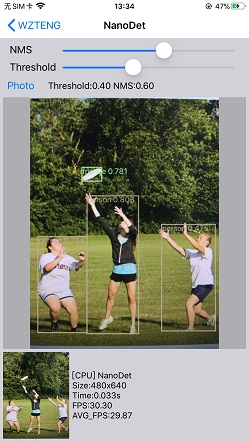

## :rocket: 如果有帮助，点个star！:star: ##

### 移动端MNN部署，摄像头实时捕获视频流进行检测。

## iOS:
- Xcode 12.4
- macOS 11.2.3
- iPhone 6sp 13.5.1

## Android:
- Android Studio 4.1.1
- Win10 20H2
- CPU:Qualcomm 710 GPU:Adreno 616

安卓已经增加权限申请，但如果还是闪退请手动确认下相关权限是否允许。

> Android
```
从界面中选择需要测试的模型。
```
> iOS
```
从界面中选择需要测试的模型。
```

### 模型
| model | android | iOS | from |
|-------------------|:--------:|:--------:|:--------:|
| NanoDet           | yes | yes |  [Github](https://github.com/RangiLyu/nanodet)   |

### Android：
* 由于手机性能、图像尺寸等因素导致FPS在不同手机上相差比较大。该项目主要测试MNN框架的使用，具体模型的转换可以去MNN官方查看转换教程。<br/>
* 由于opencv库太大只保留 arm64-v8a/armeabi-v7a 有需要其它版本的自己去官方下载。
* AS版本不一样可能编译会有各种问题，如果编译错误无法解决、建议使用AS4.0以上版本尝试一下。

### iOS:
- 如果缺少模型请从 "android_MNN_Demo\app\src\main\assets" 复制 .mnn 文件到 "iOS_MNN_Demo\MNNDemo\res" 下。
- iOS如果opencv2.framework有用到也需要重新下载并替换到工程。

由于MNN不同版本可能会出现功能异常请注意版本，当前使用的是1.0版本。

懒人本地转换(不会上传模型): [xxxx -> mnn](https://convertmodel.com/)

轻量级OpenCV:[opencv-mobile](https://github.com/nihui/opencv-mobile)

:art: 截图<br/>

| Android | iOS |
|:-----:|:-----:|
||  |

> Android

| nanodet |
|---------|
||

> iOS

| NanoDet |
|---------|
|  |


感谢:<br/>
- https://github.com/alibaba/MNN

