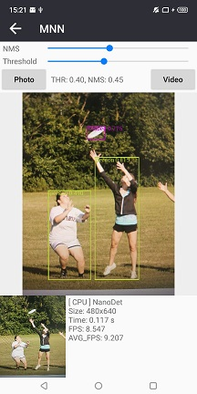

## :rocket: 如果有帮助，点个star！:star: ##

### 移动端MNN部署，摄像头实时捕获视频流进行检测。


## Android:
- Android Studio 4.1.1
- Win10 20H2
- Meizu 16x 8.1.0 (CPU:Qualcomm 710 GPU:Adreno 616)

安卓已经增加权限申请，但如果还是闪退请手动确认下相关权限是否允许。

> Android
```
从界面中选择需要测试的模型。
```
### 模型
| model | android | iOS | from |
|-------------------|:--------:|:--------:|:--------:|
| NanoDet           | yes | no |  [Github](https://github.com/RangiLyu/nanodet)   |


### Android：
* 由于手机性能、图像尺寸等因素导致FPS在不同手机上相差比较大。该项目主要测试MNN框架的使用，具体模型的转换可以去MNN官方查看转换教程。<br/>
* 由于opencv库太大只保留 arm64-v8a/armeabi-v7a 有需要其它版本的自己去官方下载。
* AS版本不一样可能编译会有各种问题，如果编译错误无法解决、建议使用AS4.0以上版本尝试一下。

懒人本地转换(不会上传模型): [xxxx -> mnn] https://convertmodel.com/


:art: 截图<br/>

> Android

| nanodet | xxxxxx | xxxxxx |
|-------------------|-------------|---------|
|| none| none |


感谢:<br/>
- https://github.com/alibaba/MNN

